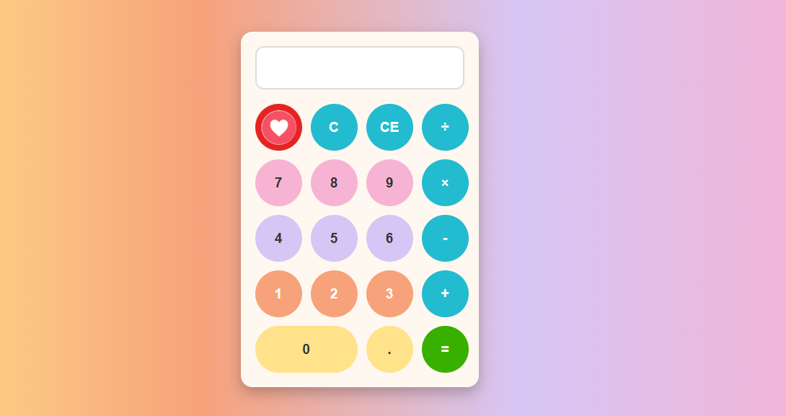

# 📟 Calculadora | Calculator

Calculadora simples desenvolvida com **HTML5, CSS3 e JavaScript**.  
A interface foi inspirada em calculadoras físicas, com botões arredondados e coloridos, em layout responsivo.

---

## 📋 Detalhes | Details

- ➕➖✖️➗ Realiza operações básicas: **adição, subtração, multiplicação e divisão**  
- 🧹 Função **C**: limpa todo o conteúdo do visor  
- ⬅️ Função **CE**: deleta apenas o último dígito  
- 🔢 Permite apenas **um ponto decimal (".")** por número inserido  
- 🚫 Não permite inserir mais de um operador matemático em sequência  
- 🛡️ Desenvolvida **sem uso da função `eval()`** (parser próprio de expressões)  

---

## 🎨 Layout

- Botões arredondados e coloridos (estilo "pastel").  
- Imagem de estrela posicionada como um botão decorativo.  
- Estrutura em **CSS Grid**, mantendo a organização no estilo de uma calculadora tradicional.  

---

## 🚀 Tecnologias | Technologies

- **HTML5**  
- **CSS3**  
- **JavaScript (ES6)**  

---

## 📂 Estrutura de Pastas | Folder Structure

/src
/img
imagem.png # ícone de coração usado no layout
index.html
style.css
script.js
---

## 📸 Preview

Aqui está o visual atual da calculadora:

